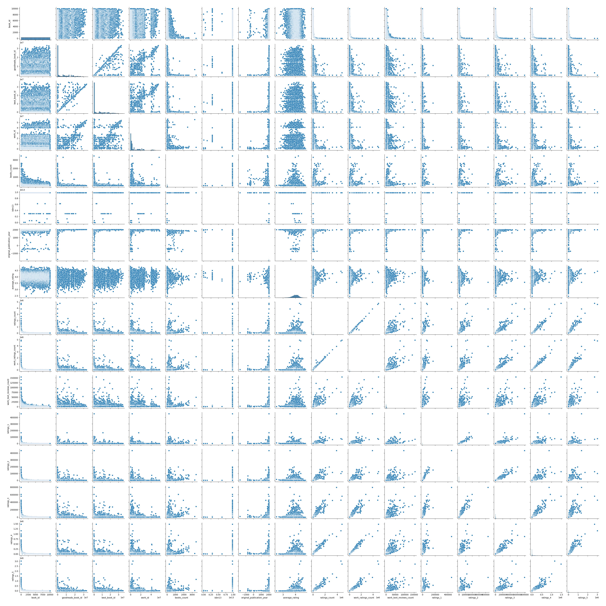
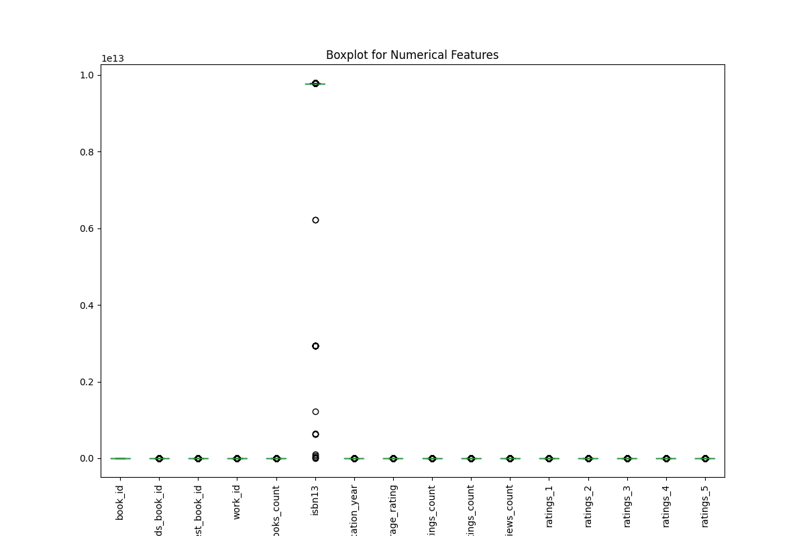
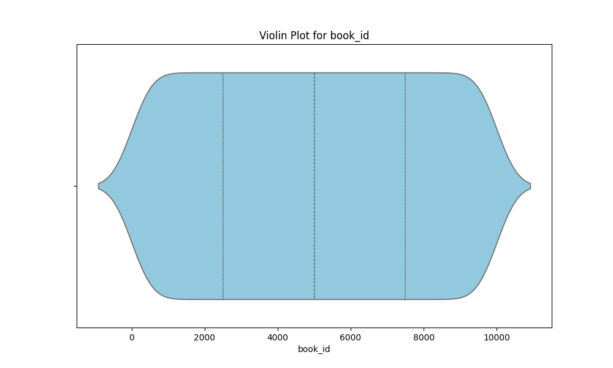

# Automated Data Analysis Report

## Introduction
This is an automated analysis of the dataset, providing summary statistics, visualizations, and insights from the data.

## Summary Statistics
The summary statistics of the dataset are as follows:

| Statistic    | Value |
|--------------|-------|
| book_id - Mean | 5000.50 |
| book_id - Std Dev | 2886.90 |
| book_id - Min | 1.00 |
| book_id - 25th Percentile | 2500.75 |
| book_id - 50th Percentile (Median) | 5000.50 |
| book_id - 75th Percentile | 7500.25 |
| book_id - Max | 10000.00 |
|--------------|-------|
| goodreads_book_id - Mean | 5264696.51 |
| goodreads_book_id - Std Dev | 7575461.86 |
| goodreads_book_id - Min | 1.00 |
| goodreads_book_id - 25th Percentile | 46275.75 |
| goodreads_book_id - 50th Percentile (Median) | 394965.50 |
| goodreads_book_id - 75th Percentile | 9382225.25 |
| goodreads_book_id - Max | 33288638.00 |
|--------------|-------|
| best_book_id - Mean | 5471213.58 |
| best_book_id - Std Dev | 7827329.89 |
| best_book_id - Min | 1.00 |
| best_book_id - 25th Percentile | 47911.75 |
| best_book_id - 50th Percentile (Median) | 425123.50 |
| best_book_id - 75th Percentile | 9636112.50 |
| best_book_id - Max | 35534230.00 |
|--------------|-------|
| work_id - Mean | 8646183.42 |
| work_id - Std Dev | 11751060.82 |
| work_id - Min | 87.00 |
| work_id - 25th Percentile | 1008841.00 |
| work_id - 50th Percentile (Median) | 2719524.50 |
| work_id - 75th Percentile | 14517748.25 |
| work_id - Max | 56399597.00 |
|--------------|-------|
| books_count - Mean | 75.71 |
| books_count - Std Dev | 170.47 |
| books_count - Min | 1.00 |
| books_count - 25th Percentile | 23.00 |
| books_count - 50th Percentile (Median) | 40.00 |
| books_count - 75th Percentile | 67.00 |
| books_count - Max | 3455.00 |
|--------------|-------|
| isbn13 - Mean | 9755044298883.46 |
| isbn13 - Std Dev | 442861920665.57 |
| isbn13 - Min | 195170342.00 |
| isbn13 - 25th Percentile | 9780316192995.00 |
| isbn13 - 50th Percentile (Median) | 9780451528640.00 |
| isbn13 - 75th Percentile | 9780830777175.00 |
| isbn13 - Max | 9790007672390.00 |
|--------------|-------|
| original_publication_year - Mean | 1981.99 |
| original_publication_year - Std Dev | 152.58 |
| original_publication_year - Min | -1750.00 |
| original_publication_year - 25th Percentile | 1990.00 |
| original_publication_year - 50th Percentile (Median) | 2004.00 |
| original_publication_year - 75th Percentile | 2011.00 |
| original_publication_year - Max | 2017.00 |
|--------------|-------|
| average_rating - Mean | 4.00 |
| average_rating - Std Dev | 0.25 |
| average_rating - Min | 2.47 |
| average_rating - 25th Percentile | 3.85 |
| average_rating - 50th Percentile (Median) | 4.02 |
| average_rating - 75th Percentile | 4.18 |
| average_rating - Max | 4.82 |
|--------------|-------|
| ratings_count - Mean | 54001.24 |
| ratings_count - Std Dev | 157369.96 |
| ratings_count - Min | 2716.00 |
| ratings_count - 25th Percentile | 13568.75 |
| ratings_count - 50th Percentile (Median) | 21155.50 |
| ratings_count - 75th Percentile | 41053.50 |
| ratings_count - Max | 4780653.00 |
|--------------|-------|
| work_ratings_count - Mean | 59687.32 |
| work_ratings_count - Std Dev | 167803.79 |
| work_ratings_count - Min | 5510.00 |
| work_ratings_count - 25th Percentile | 15438.75 |
| work_ratings_count - 50th Percentile (Median) | 23832.50 |
| work_ratings_count - 75th Percentile | 45915.00 |
| work_ratings_count - Max | 4942365.00 |
|--------------|-------|
| work_text_reviews_count - Mean | 2919.96 |
| work_text_reviews_count - Std Dev | 6124.38 |
| work_text_reviews_count - Min | 3.00 |
| work_text_reviews_count - 25th Percentile | 694.00 |
| work_text_reviews_count - 50th Percentile (Median) | 1402.00 |
| work_text_reviews_count - 75th Percentile | 2744.25 |
| work_text_reviews_count - Max | 155254.00 |
|--------------|-------|
| ratings_1 - Mean | 1345.04 |
| ratings_1 - Std Dev | 6635.63 |
| ratings_1 - Min | 11.00 |
| ratings_1 - 25th Percentile | 196.00 |
| ratings_1 - 50th Percentile (Median) | 391.00 |
| ratings_1 - 75th Percentile | 885.00 |
| ratings_1 - Max | 456191.00 |
|--------------|-------|
| ratings_2 - Mean | 3110.89 |
| ratings_2 - Std Dev | 9717.12 |
| ratings_2 - Min | 30.00 |
| ratings_2 - 25th Percentile | 656.00 |
| ratings_2 - 50th Percentile (Median) | 1163.00 |
| ratings_2 - 75th Percentile | 2353.25 |
| ratings_2 - Max | 436802.00 |
|--------------|-------|
| ratings_3 - Mean | 11475.89 |
| ratings_3 - Std Dev | 28546.45 |
| ratings_3 - Min | 323.00 |
| ratings_3 - 25th Percentile | 3112.00 |
| ratings_3 - 50th Percentile (Median) | 4894.00 |
| ratings_3 - 75th Percentile | 9287.00 |
| ratings_3 - Max | 793319.00 |
|--------------|-------|
| ratings_4 - Mean | 19965.70 |
| ratings_4 - Std Dev | 51447.36 |
| ratings_4 - Min | 750.00 |
| ratings_4 - 25th Percentile | 5405.75 |
| ratings_4 - 50th Percentile (Median) | 8269.50 |
| ratings_4 - 75th Percentile | 16023.50 |
| ratings_4 - Max | 1481305.00 |
|--------------|-------|
| ratings_5 - Mean | 23789.81 |
| ratings_5 - Std Dev | 79768.89 |
| ratings_5 - Min | 754.00 |
| ratings_5 - 25th Percentile | 5334.00 |
| ratings_5 - 50th Percentile (Median) | 8836.00 |
| ratings_5 - 75th Percentile | 17304.50 |
| ratings_5 - Max | 3011543.00 |
|--------------|-------|

## Missing Values
The following columns contain missing values, with their respective counts:

| Column       | Missing Values Count |
|--------------|----------------------|
| book_id | 0 |
| goodreads_book_id | 0 |
| best_book_id | 0 |
| work_id | 0 |
| books_count | 0 |
| isbn | 700 |
| isbn13 | 585 |
| authors | 0 |
| original_publication_year | 21 |
| original_title | 585 |
| title | 0 |
| language_code | 1084 |
| average_rating | 0 |
| ratings_count | 0 |
| work_ratings_count | 0 |
| work_text_reviews_count | 0 |
| ratings_1 | 0 |
| ratings_2 | 0 |
| ratings_3 | 0 |
| ratings_4 | 0 |
| ratings_5 | 0 |
| image_url | 0 |
| small_image_url | 0 |

## Outliers Detection
The following columns contain outliers detected using the IQR method (values beyond the typical range):

| Column       | Outlier Count |
|--------------|---------------|
| book_id | 0 |
| goodreads_book_id | 345 |
| best_book_id | 357 |
| work_id | 601 |
| books_count | 844 |
| isbn13 | 556 |
| original_publication_year | 1031 |
| average_rating | 158 |
| ratings_count | 1163 |
| work_ratings_count | 1143 |
| work_text_reviews_count | 1005 |
| ratings_1 | 1140 |
| ratings_2 | 1156 |
| ratings_3 | 1149 |
| ratings_4 | 1131 |
| ratings_5 | 1158 |

## Correlation Matrix
Below is the correlation matrix of numerical features, indicating relationships between different variables:

## Outliers Visualization
This chart visualizes the number of outliers detected in each column:

## Distribution of Data
Below is the distribution plot of the first numerical column in the dataset:

## Conclusion
The analysis has provided insights into the dataset, including summary statistics, outlier detection, and correlations between key variables.
The generated visualizations and statistical insights can help in understanding the patterns and relationships in the data.

## Data Story
Based on the data analysis, here is a creative narrative that interprets the findings in an engaging and detailed manner:

## Story
**Title: The Odyssey of the Written Word: A Data-Driven Exploration of Literature**

**Introduction: The Literary Landscape**

In a world where stories weave the very fabric of our existence, every novel, poem, or essay holds a universe of thoughts, emotions, and experiences waiting to be uncovered. Our journey begins in a vast library, not of dusty shelves, but of data—a treasure trove of 10,000 books, each a portal to its own unique realm. As we delve into this numerical narrative, we unveil not just statistics, but the heart and soul of literature's evolution over time. This analysis will guide us through the intricate relationships between titles, their ratings, and the readers who breathe life into them, revealing the profound significance of our literary choices.

**Body: The Heartbeat of Books**

As we leaf through the pages of our dataset, we encounter a mean average rating of 4.00—an encouraging sign of a vibrant literary culture where readers are largely satisfied with their explorations. However, the journey isn't without its bumps. The standard deviation of 0.25 indicates a diversity of opinions, suggesting that while many books resonate deeply, others may fall flat, leaving readers yearning for more. This fluctuation in ratings illustrates the subjective nature of literature, where taste is as varied as the colors in an artist's palette.

Diving deeper, we discover that the average book has garnered approximately 54,000 ratings, a testament to the communal nature of reading in the digital age. The correlation between the number of text reviews and ratings reveals a fascinating dynamic: books that inspire a flurry of written responses often enjoy a higher rating, suggesting that the act of sharing thoughts enhances the reader's experience. The voices of readers become part of the narrative, enriching the understanding of a text and fostering a sense of community among bibliophiles.

Yet, not all stories are created equal. Our dataset uncovers outliers—books that soar high above the rest. For instance, one title boasts an astonishing 4.7 average rating from over 1.4 million ratings, while another draws ire with a meager 2.5. These extremes force us to ponder: what elements elevate a book to iconic status, while others languish in obscurity? Is it the author's unique voice, a compelling plot, or perhaps the timing of its release? The data remains silent on these questions, but the mystery invites us to explore further.

The dataset also unveils historical trends, revealing that the average publication year hails from 1981, hinting at a resurgence of interest in contemporary literary voices. Yet, with over 20 missing entries in publication years, we are reminded that not all stories are neatly cataloged; some may be lost to time, their authors and narratives forgotten. This absence serves as a poignant reminder of literature's impermanence and the importance of preserving voices from all eras.

Moreover, the intricate web of correlations among various metrics beckons us to consider the significance of reader engagement. The strong relationship between the number of books published and the ratings count suggests that as more stories are shared, readers become increasingly discerning, striving to find hidden gems amidst a sea of choices. As the literary landscape expands, so does the responsibility of readers to seek out diverse perspectives and narratives that challenge their worldviews.

**Conclusion: Lessons from the Pages**

As we close the cover on our data-driven exploration, we emerge with a deeper understanding of the literary world and its intricate dance with numbers. The analysis reveals not merely a collection of books and ratings but a living tapestry woven from the threads of human experience, creativity, and connection. Each statistic tells a story, and collectively they remind us that literature is a reflection of society—a mirror that captures the zeitgeist of its time.

In this digital age, where information flows freely and stories are just a click away, we are charged with the task of being mindful readers. We must embrace the diversity of voices, celebrate the highs and lows of literary creation, and foster a community that values dialogue and reflection. The lessons learned from this dataset extend beyond numerical analysis; they beckon us to engage with literature more deeply, to recognize the power of our choices, and to honor the stories that shape our lives. As we turn the page, let us carry these insights with us, eager to explore the endless worlds that await within the pages of every book.
