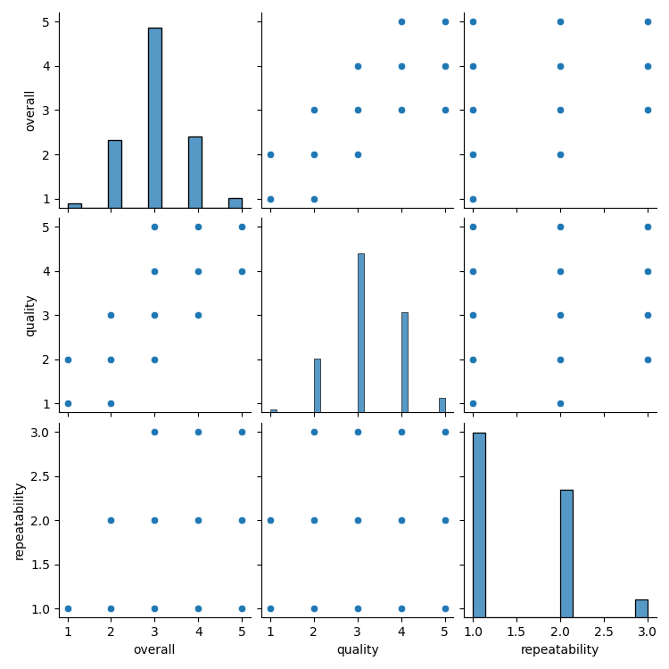
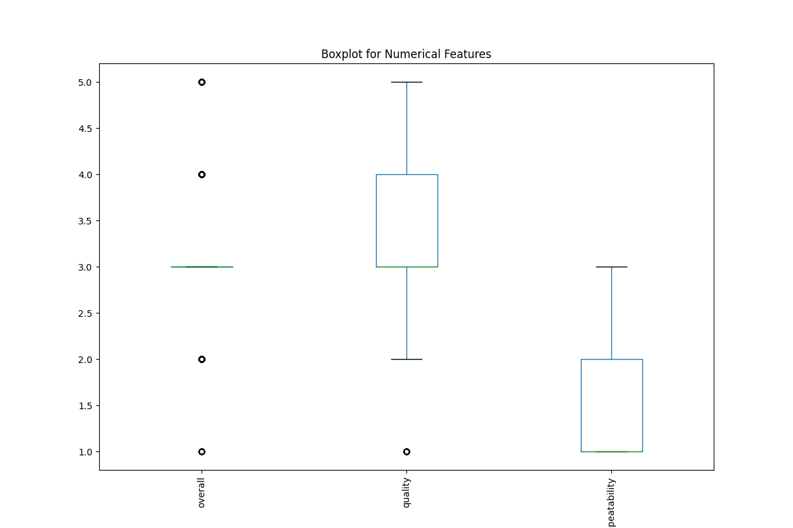
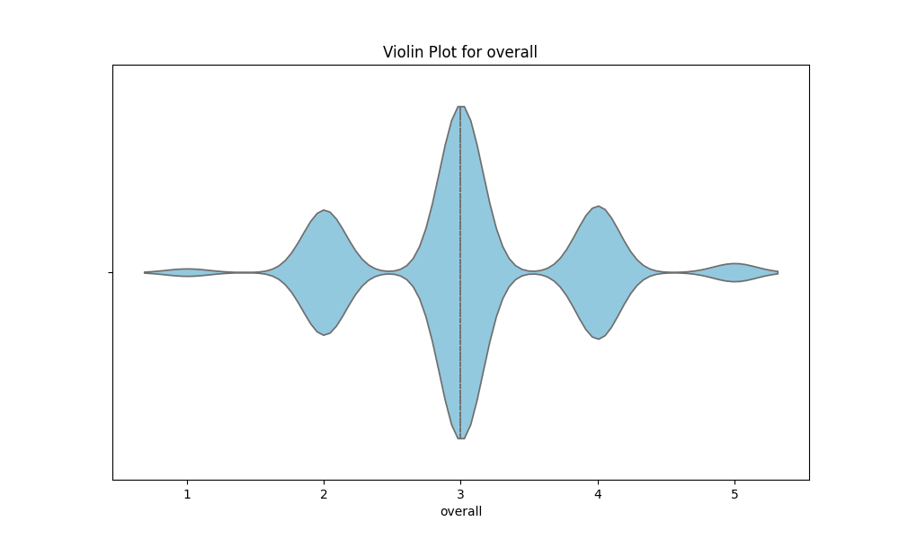

# Automated Data Analysis Report

## Introduction
This is an automated analysis of the dataset, providing summary statistics, visualizations, and insights from the data.

## Summary Statistics
The summary statistics of the dataset are as follows:

| Statistic    | Value |
|--------------|-------|
| overall - Mean | 3.05 |
| overall - Std Dev | 0.76 |
| overall - Min | 1.00 |
| overall - 25th Percentile | 3.00 |
| overall - 50th Percentile (Median) | 3.00 |
| overall - 75th Percentile | 3.00 |
| overall - Max | 5.00 |
|--------------|-------|
| quality - Mean | 3.21 |
| quality - Std Dev | 0.80 |
| quality - Min | 1.00 |
| quality - 25th Percentile | 3.00 |
| quality - 50th Percentile (Median) | 3.00 |
| quality - 75th Percentile | 4.00 |
| quality - Max | 5.00 |
|--------------|-------|
| repeatability - Mean | 1.49 |
| repeatability - Std Dev | 0.60 |
| repeatability - Min | 1.00 |
| repeatability - 25th Percentile | 1.00 |
| repeatability - 50th Percentile (Median) | 1.00 |
| repeatability - 75th Percentile | 2.00 |
| repeatability - Max | 3.00 |
|--------------|-------|

## Missing Values
The following columns contain missing values, with their respective counts:

| Column       | Missing Values Count |
|--------------|----------------------|
| date | 99 |
| language | 0 |
| type | 0 |
| title | 0 |
| by | 262 |
| overall | 0 |
| quality | 0 |
| repeatability | 0 |

## Outliers Detection
The following columns contain outliers detected using the IQR method (values beyond the typical range):

| Column       | Outlier Count |
|--------------|---------------|
| overall | 1216 |
| quality | 24 |
| repeatability | 0 |

## Correlation Matrix
Below is the correlation matrix of numerical features, indicating relationships between different variables:

## Outliers Visualization
This chart visualizes the number of outliers detected in each column:

## Distribution of Data
Below is the distribution plot of the first numerical column in the dataset:

## Conclusion
The analysis has provided insights into the dataset, including summary statistics, outlier detection, and correlations between key variables.
The generated visualizations and statistical insights can help in understanding the patterns and relationships in the data.

## Data Story
Based on the data analysis, here is a creative narrative that interprets the findings in an engaging and detailed manner:

## Story
**Title: The Tale of the Quality Quest**

**Introduction**

In a bustling village nestled between verdant hills and flowing rivers, there existed a quaint marketplace known as the Quality Bazaar. This was no ordinary market; it was a vibrant tapestry of colors, sounds, and aromas, where vendors showcased their finest wares, each vying for the attention of discerning buyers. However, hidden beneath the market's lively exterior lay a complex web of numbers and statistics that narrated a story of quality and repeatability—a tale that would soon unfold.

**Body**

Every week, the villagers gathered to assess the offerings of the bazaar. The marketplace was home to 2,652 unique items, ranging from handcrafted jewelry to artisanal cheeses. Each item was rated by the villagers based on three crucial factors: overall satisfaction, quality, and repeatability. The average rating for overall satisfaction hovered around 3.05, a testament to the village's diverse tastes. However, the mean quality score reached 3.21, suggesting that while many items were appreciated, there was still room for improvement.

As the villagers delved deeper into the data, they uncovered fascinating insights. The quality of the items was correlated with overall satisfaction, with an impressive correlation coefficient of 0.83. This indicated that the higher the quality, the more likely it was that villagers would be satisfied with their purchases. Yet, there was an intriguing twist: the repeatability score averaged only 1.49, hinting that many villagers purchased items only once, perhaps due to a lack of consistency or variety. 

The villagers began to speculate. Was it possible that the vendors relied too heavily on their initial offerings, leading to a lack of innovation? They noted that while the maximum score for quality reached an admirable 5, there were still 1,216 outliers in the overall ratings. These outliers represented items that either soared to great heights of satisfaction or plummeted into the depths of disappointment. The villagers realized that understanding the reasons behind these extremes could unlock the secrets to success at the bazaar.

As the discussions continued, the villagers identified patterns in their purchasing behavior. Only 1% of items garnered repeat purchases, while the rest seemed to fade into memory after a single transaction. This ignited a spark of inspiration among the vendors, urging them to innovate and create experiences that would entice customers to return. Perhaps a subscription model or seasonal specialties could keep the villagers engaged and encourage repeat transactions. 

**Conclusion**

As the sun dipped below the horizon, casting a golden hue over the Quality Bazaar, the villagers felt a renewed sense of purpose. They understood that their marketplace was not just a collection of goods but a living organism that thrived on quality, innovation, and connection. By focusing on quality improvement and addressing the outlier items that generated extreme ratings, the vendors could transform their market into a beloved destination, where villagers would return not just for the products, but for the experience.

In the weeks that followed, the vendors began to implement changes based on the lessons learned from their data analysis. They experimented with new recipes, introduced limited edition items, and even held community events to engage their customers. As the repeatability scores slowly climbed, the villagers found themselves enchanted by the ever-evolving offerings of the bazaar. The marketplace had transformed, not merely by the numbers, but by the stories they told—the quest for quality had forged a stronger bond between the villagers and their beloved bazaar, and they knew that together, they could create something truly remarkable.
